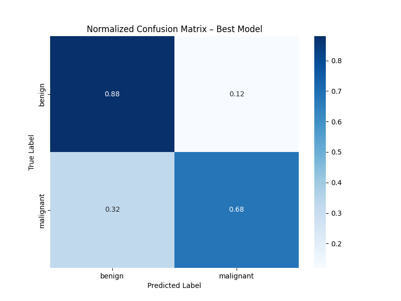

# DermAI — Skin Disease Detection Pipeline

> End-to-end MLOps pipeline for classifying skin diseases from images, built with TensorFlow/Keras, FastAPI, Streamlit, Supabase, and Docker.

---

## Video Demo

[ Watch on YouTube](https://youtu.be/tprRabI7IjQ)


---

## Live URL

| Service | URL |
|---|---|
| Streamlit UI | `https://ml-frontend-0qhu.onrender.com/` |


---

## Project Description

DermAI classifies skin disease images using a fine-tuned MobileNetV2 model. It exposes a full MLOps pipeline:

- **Data acquisition** — images uploaded via the UI are stored in a Supabase Storage bucket.
- **Data processing** — images are resized to 224×224, normalised with MobileNetV2's `preprocess_input`, and augmented (flip, rotation, zoom) during retraining.
- **Model creation & training** — MobileNetV2 backbone, last 40 layers unfrozen for fine-tuning, trained with early stopping and ReduceLROnPlateau.
- **Model testing** — evaluation metrics (accuracy, loss, F1, precision, recall, confusion matrix) are produced in the Jupyter notebook.
- **Model retraining** — a single button in the UI triggers a background job that downloads fresh data from Supabase, merges it with the original dataset, and retrains.
- **API** — FastAPI serves `/predict`, `/upload`, `/retrain`, `/retrain/status`, and `/uptime`.
- **UI** — Streamlit dashboard shows live model uptime, prediction results, training plots, bulk upload, and retrain controls.
- **Load testing** — Locust flood simulation results are shown below.

---

## Repository Structure

```
MLOP-Summative-assignment/
├── README.md
├── docker-compose.yml
├── .env.example
├── locust/
│   └── locustfile.py          # Locust flood simulation
├── backend/
│   ├── Dockerfile
│   ├── requirements.txt
│   ├── api/
│   │   ├── app.py             # FastAPI routes
│   │   ├── prediction.py      # Inference logic
│   │   ├── retrain.py         # Retraining pipeline
│   │   └── upload_new_data.py # Supabase upload
│   ├── model/
│   │   ├── skin_disease_detection.keras
│   │   └── encoder.pkl
│   └── notebooks/
│       └── MLOP_Summative_assignment.ipynb
└── frontend/
    ├── Dockerfile
    ├── requirements.txt
    └── ui/
        ├── streamlit_app.py
        └── plots/
            ├── accuracy_curve.png
            ├── loss_curve.png
            ├── confusion_matrix.png
            └── class_distribution.png
```

---

## Setup Instructions

### Prerequisites

- Docker Desktop (or Docker Engine + Compose plugin)
- Git
- A free [Supabase](https://supabase.com) account

### 1. Clone the repository

```bash
git clone git@github.com:Sharif2138/MLOP-Summative-assignment-.git
cd MLOP-Summative-assignment-
```

### 2. Configure environment variables

```bash
touch .env
```

Open `.env` and fill in your Supabase project URL and anon key:

```
supabase_project_url=https://xxxxxxxxxxxx.supabase.co
supabase_anon_key=eyJhbGci...
```

You can find these in your Supabase dashboard under **Project Settings → API**.

### 3. Create the Supabase storage bucket

In the Supabase dashboard:

1. Go to **Storage → New bucket**.
2. Name it `training_data` and make it **private**.
3. Inside the bucket, create two folders: `training_data/original_data` and `training_data/new_data`.
4. Upload your original training images into `training_data/original_data/<class_name>/`.

### 4. Build and start the containers

```bash
docker compose up --build
```

- API: [http://localhost:8000](http://localhost:8000)
- Swagger docs: [http://localhost:8000/docs](http://localhost:8000/docs)
- Streamlit UI: [http://localhost:8501](http://localhost:8501)

### 5. Run the Jupyter notebook (optional)

```bash
cd backend
pip install -r requirements.txt
jupyter notebook notebooks/MLOP_Summative_assignment.ipynb
```

---

## Flood Request Simulation (Locust)

### Setup

```bash
pip install locust
cp /path/to/any/skin/image.jpg locust/test_image.jpg
```

### Run

```bash
cd locust
locust -f locustfile.py --host http://localhost:8000
```

Open [http://localhost:8089](http://localhost:8089), set users and spawn rate, and click **Start**.

### Results

The screenshots below shows results from the `/predict` endpoint under different Docker container counts.


## API Endpoints

| Method | Endpoint | Description |
|---|---|---|
| GET | `/` | Health check |
| GET | `/uptime` | Returns model uptime in seconds |
| POST | `/predict` | Upload an image, returns class + confidence |
| POST | `/upload` | Bulk-upload images for retraining |
| POST | `/retrain` | Triggers background retraining |

---

## Model Evaluation (from Notebook)

     .png>)  

.png>)

---

## Tech Stack

| Layer | Technology |
|---|---|
| Model | TensorFlow 2.19, Keras, MobileNetV2 |
| API | FastAPI, Uvicorn |
| UI | Streamlit |
| Storage | Supabase Storage |
| Containerisation | Docker, Docker Compose |
| Load testing | Locust |
